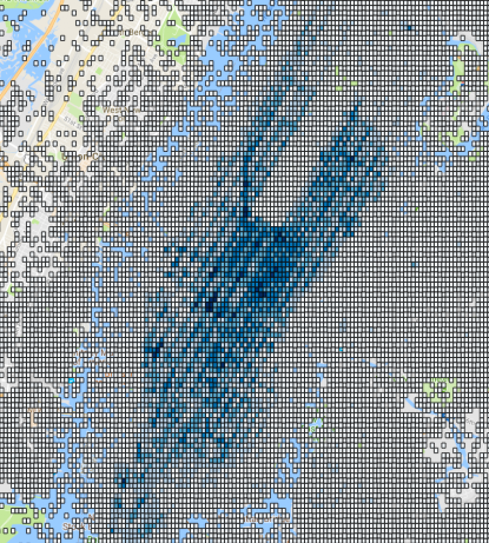

# heatmaps for big spatial data

building heatmpas for large amounts of spatial data in different tools:

- esri
- geospark
- geomesa
- https://github.com/uber/deck.gl ?

## the data
Going along with: https://github.com/Esri/gis-tools-for-hadoop/wiki/Aggregating-CSV-Data-%28Spatial-Binning%29 the data
can be obtained here:
> The sample data being used are 2013 NYC taxi data. This dataset is freely available for download. For this tutorial, we will only download trip_data_1.csv.zip for simplicity from https://archive.org/download/nycTaxiTripData2013/trip_data.7z.

The whole ZIP could be read by https://stackoverflow.com/questions/28969757/zip-support-in-apache-spark/45958182#45958182, but for simplicity, I will follow along with esri, unzip first and then only load a single file.

### tools
**ESRI**
- marries open source (hadoop connector) with their proprietatry visualization tool
I demonstrate how to use their libraries - but visualize in an open tool like qgis

The result looks like:

